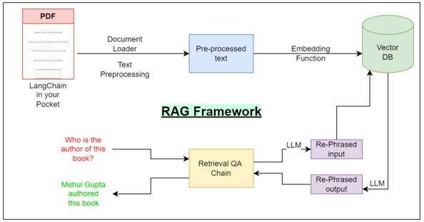

# RAG在工业里的场景中应用的相关文献阅读
## 前言
- 本仓库主要记录研究生期间论文阅读过程，包括但不限于论文翻译、论文内化笔记、核心代码理解、读论文过程中产生的心得体会、问题、idea等等。
- 建立本仓库的目的主要是方便自己回顾所读过的内容，督促自己不断学习，本仓库下所有内容均不作为教学。

# 论文阅读目录，点击跳转到对应的branch
- [MEDAGENTS: LLM as Collaborators for Zero-shot Medical Reason](https://github.com/ZzhuL/RAG_literature-reading/tree/main/domain%20agent/MEDAGENTS%3A%20LLM%20as%20Collaborators%20for%20Zero-shot%20Medical%20Reason)
